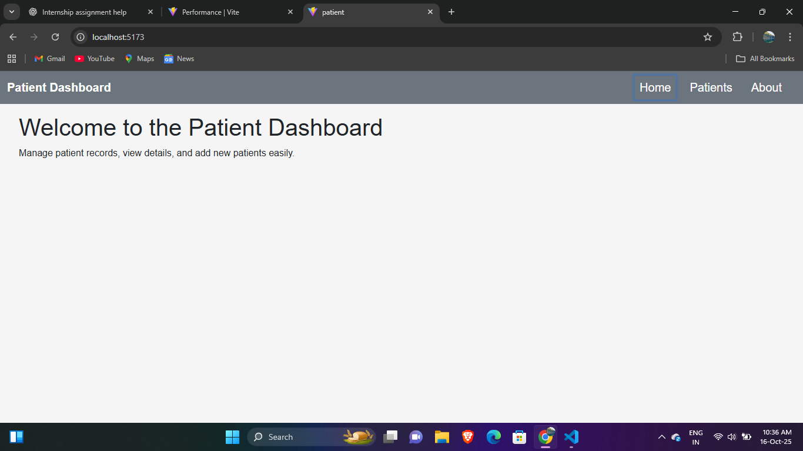
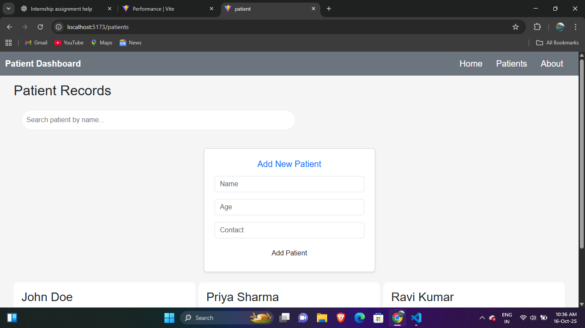
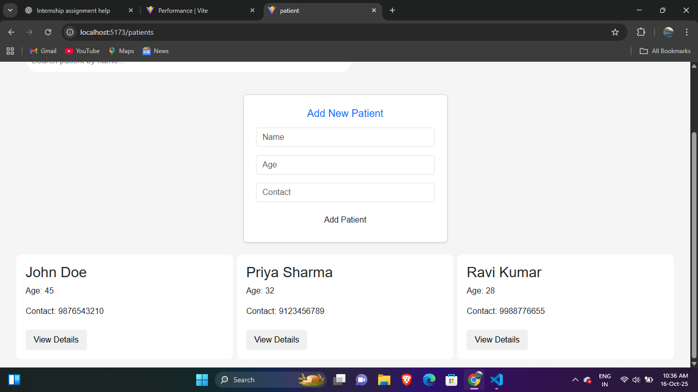

# Jarurat_Care
# Patient Dashboard
## Screenshots

### 1. Home Page


### 2. Patients Page


### 3. Add Patient Form


## Overview
A simple React-based web application to manage patient records.  
Features include:
- List of patients with name, age, contact
- Search patients by name
- View patient details in a modal
- Add new patients (local state)
- Responsive design using Bootstrap

## Tech Stack
- React (Vite)
- Bootstrap for UI
- React Router for navigation
- Mock JSON for patient data

## Installation
1. Clone the repository:
```bash
git clone https://github.com/username/patient-dashboard.git
```
2.Install dependencies:
```bash
npm install
```
3.Deployment
```bash
npm run build
```


